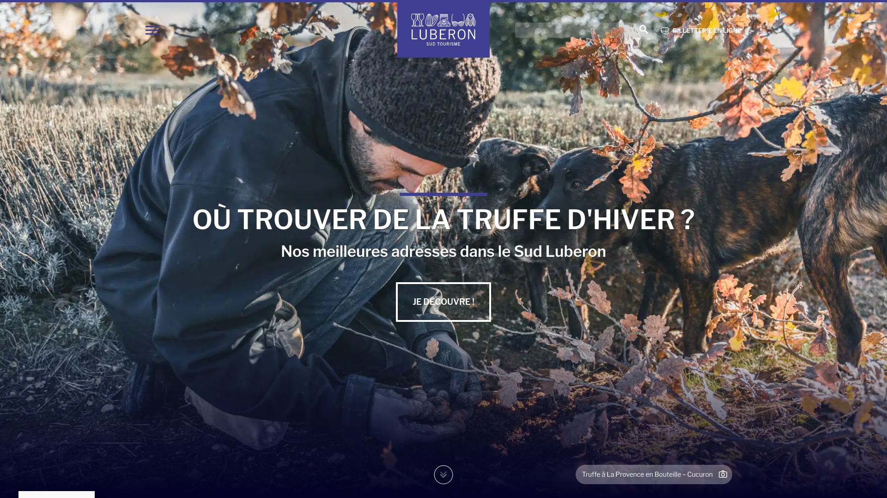

# Luberon Sud Tourisme WordPress Theme

WordPress theme made during my time at [e-labo](https://e-labo.biz/)

This theme was made using a custom base template, called Dédé, which follows the [WordPress Template Hierarchy](https://developer.wordpress.org/themes/basics/template-hierarchy/)

This is version 1.5 of the theme. It uses PHP as its main component, with some JavaScript (to register new blocks in Gutenberg, the header menu, and some sticky elements), and SCSS for the styling of the theme. 

The theme also has a companion Gutenberg plugin called [Content Summary](https://github.com/JulienRevest/content-summary), which generates a title list for all the titles in a single, and adds social links if needed.

This theme uses e-labo's new updating system, with Easy Digital Download. For security purposes, this functionnality has been removed.